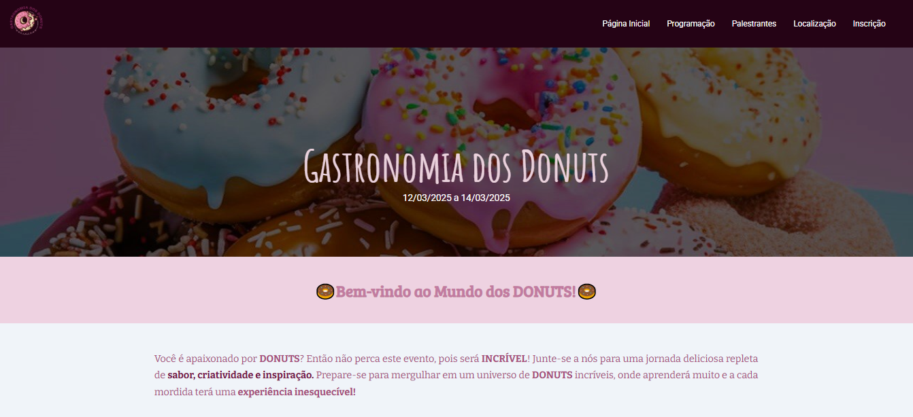

# 🍩 Gastronomia dos Donuts

Projeto fictício de um evento gastronômico em São Paulo, dedicado ao universo dos donuts.  
O site apresenta **programação, palestrantes, localização e formulário de inscrição**, com um design doce e atrativo.

---

## 📸 Demonstração


### Print do site


---

## ✨ Funcionalidades

- Página inicial com:
  - Capa do evento e datas
  - Programação completa (3 dias de atividades)
  - Seção de palestrantes com foto e descrição
  - Vídeo de divulgação
  - Localização com mapa interativo
  - Links de redes sociais e contatos

- Página de inscrição com:
  - Formulário completo (nome, e-mail, telefone, idade, profissão, restrições alimentares etc.)
  - Regras e observações do evento
  - Contatos e redes sociais

---

## 🛠️ Tecnologias utilizadas


- **HTML5** → Estrutura do projeto  
- **CSS3** → Estilização e animações  
- **Google Fonts** → Tipografia personalizada  
- **JavaScript (script.js)** → Comportamentos dinâmicos (interações do site)  
- **Responsividade** → Layout adaptado para desktop e dispositivos móveis  

---

## 📂 Estrutura do projeto

```
📁 Gastronomia-dos-Donuts
 ┣ 📄 index.html           # Página inicial do evento
 ┣ 📄 inscricao.html       # Página de inscrição
 ┣ 📄 header_pag_inicial.css
 ┣ 📄 main_pag_inicial.css
 ┣ 📄 footer_pag_inicial.css
 ┣ 📄 header_insc.css
 ┣ 📄 footer_insc.css
 ┣ 📄 main_insc.css        # (não incluso, mas referenciado)
 ┣ 📄 script.js            # Funções de interação
 ┣ 📁 Imagens              # Logos, palestrantes, donuts, ícones etc.
```

---

## 🚀 Como executar o projeto

1. Clone este repositório:
   ```bash
   git clone https://github.com/SEU-USUARIO/Gastronomia-dos-Donuts.git
   ```

2. Abra a pasta do projeto:
   ```bash
   cd Gastronomia-dos-Donuts
   ```

3. Abra o arquivo `index.html` no navegador de sua preferência.

---

## 📅 Evento fictício

🗓️ **12 a 14 de março de 2025 — São Paulo, SP**  
Este projeto foi desenvolvido apenas para fins **educacionais** durante o Programa Descodificadas e não representa um evento real.

---

## 👩‍💻 Autora

Desenvolvido com carinho por **July Ribeiro** 💖  
  
